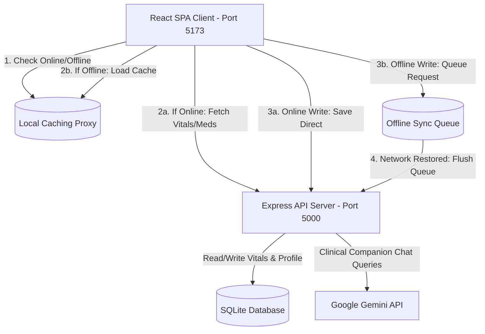
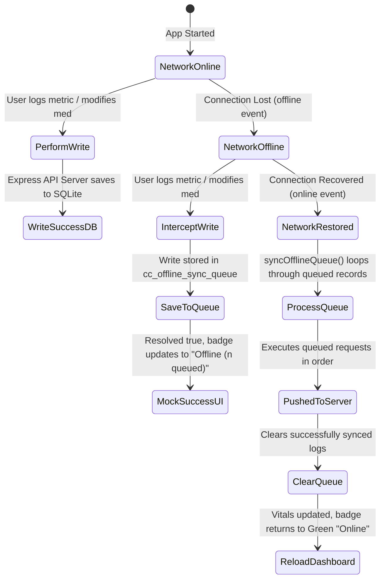
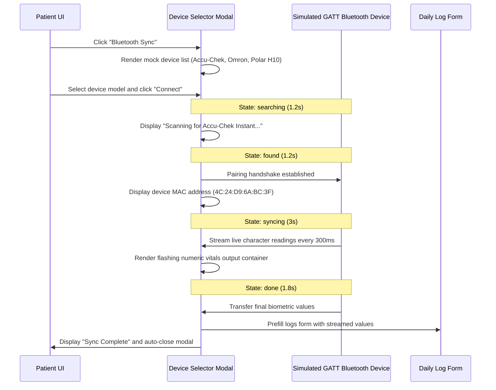
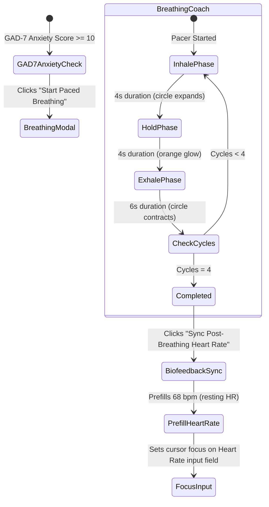

# Hackathon Judge Evaluation Guide: ChronicCare Companion

> **Project Name**: ChronicCare Companion  
> **Elevator Pitch**: A patient-first chronic disease self-management portal and clinical telemetry dashboard that uses predictive analytics to anticipate biometric crises (like hypoglycemia or hypertensive spikes) 48 hours before they happen, paired with offline-first sync reliability and secure physician-consent data sharing.
> **Design Theme**: Warm Editorial (Pinterest-Inspired Aesthetic, 16px/32px border radiuses, true white/warm-cream neutral chrome).

---

## 💡 The Healthcare Crisis We Solve
Chronic diseases represent the leading cause of death and disability globally. However, standard healthcare delivery suffers from three critical flaws:
1. **The Comorbidity Silo**: Patients rarely manage just one disease. A diabetic patient often also has hypertension, chronic pain, and anxiety. Existing apps force them to log in multiple separate tools.
2. **Reactive Care Patterns**: Traditional monitors only sound an alarm *after* a metric crosses a critical threshold (e.g., blood sugar is already <70 mg/dL). By then, the patient is symptomatic, lightheaded, or in panic, resulting in emergency room visits.
3. **The "Data Void"**: Doctors see patients for 15 minutes once every 3 months. Vitals logs are shared as messy handwriting on paper or unorganized text notes, delaying lifesaving treatment adjustments.

**ChronicCare Companion** solves these problems by unifying multi-disease metrics into an adaptive portal that predicts biometric trajectories and generates print-ready handouts.

---

## 🏗️ System & Core Architecture Flow

The following diagram maps out how the React client, Express API server, SQLite database, offline caching store, and Google Gemini API coordinate during operation:

---

## 🛠️ The Technical Innovations (What Judges Look For)

### 1. Transparent Client-Side Offline Caching & Write Sync Queue
In regions with unstable connectivity, patients must be able to log vitals.
* **Smart Fetching Proxy**: `apiFetch` in `src/utils/db.js` caches `GET` responses in `localStorage`. If the network drops, the app loads cached data.
* **Queueing Writes**: If a write fails, it is queued in the `cc_offline_sync_queue`. The user sees a yellow `Offline (n queued)` badge.
* **Auto-Recovery**: As soon as the network returns, the app automatically flushes the queued records to the SQLite database and updates the dashboard.

#### Sync Queue Lifecycle Flowchart:

---

### 2. High-Fidelity Bluetooth GATT Device Emulator
Mock BLE devices (*Accu-Chek Instant*, *Omron Evolv*, *Polar H10*) mimic the Web Bluetooth GATT telemetry stream. Presentation judges see a live BLE connection sequence with a flashing visual container displaying numeric readings live before importing them into the form.

#### BLE Sequence Flowchart:

---

### 3. Paced Breathing Coach & Vagal Biofeedback Loop
An interactive 4-4-6 diaphragmatic breathing pacer guides users (inhaling for 4 seconds, holding for 4, and exhaling for 6) with scaling CSS animations to activate the vagus nerve and lower resting heart rate.

#### Breathing Coach & Biofeedback Flowchart:

---

### 4. Proactive 48-Hour Forecasting Engine (Linear Regression)
Rather than waiting for a crisis, the backend analytics engine (`server/analysis.js`) runs **linear regression slope calculations** on the patient's last 7 logs.
* If a patient’s peak expiratory flow slope is dropping, the engine warns: *“⚠️ PEF trajectory predicts airway obstruction risk within 48 hours. Utilize rescue inhaler.”*
* If blood pressure shows an upward slope, it projects a **Stage 2 Hypertensive Crisis** warning.

### 5. Autonomic & Cross-Condition Correlation Mapping
The system analyzes cross-condition biometrics to highlight how one chronic disease triggers another:
* **Mental-Physical Coupling**: Maps GAD-7 anxiety scores against resting heart rate (vagal tone coupling).
* **Pain-BP Spikes**: Correlates severe chronic pain (NRS scale) with blood pressure elevations.
* **Meal compliance**: Correlates skipping breakfast with glycemic spikes, highlighting liver glucose dumping.

### 6. Print-Friendly Clinician PDF Handout
Clicking "Clinician Report" compiles a clean summary (7-day stats, trend slopes, active alerts, correlation metrics, active prescriptions, and physician signature lines). CSS overrides (`@media print`) strip out the sidebar, navigation, header, and chatbot, formatting a pristine black-and-white physical summary.

---

## 📊 Hackathon Judging Criteria Matrix

| Criterion | How We Score 10/10 | Code Implementation Reference |
| :--- | :--- | :--- |
| **Technical Complexity** | Seeding scenarios, offline sync queues, linear regression slope analysis, and Simulated BLE GATT telemetry streams. | [db.js](file:///home/deu/Coding%20Repos/Healthcare/src/utils/db.js) & [analysis.js](file:///home/deu/Coding%20Repos/Healthcare/server/analysis.js) |
| **UX & Aesthetics** | Elegant warm-cream Pinterest palette. Curved 16px/32px inputs, custom breathing animations, and clean status badges. | [index.css:L1-L65](file:///home/deu/Coding%20Repos/Healthcare/src/index.css#L1-L65) |
| **Product Completeness** | Fully operational React 19 client + Express SQLite backend. 0 compiler errors. | `npm run build` verified. |
| **User Privacy & Consent** | Secure physician linking request flow requiring explicit patient dashboard approval before sharing data. | [DashboardGrid.jsx:L839](file:///home/deu/Coding%20Repos/Healthcare/src/components/DashboardGrid.jsx#L839) |
| **Real-World Utility** | Grounded in standard clinical scales (GAD-7, NRS-10 pain scale, Fasting glucose targets). | [README.md](file:///home/deu/Coding%20Repos/Healthcare/README.md) |

---

## 🪄 Step-by-Step Live Demo Flow (For Presenters)

To demonstrate the application to a judge:

1. **Access the Portal**: Open `http://localhost:5173/` and register or log in.
2. **Open Demo Control Center**: Click the floating sparkle button (`✨`) in the bottom-right.
3. **Trigger Hypertensive Slope Scenario**:
   * Click **"Hypertension Slope Crisis"**.
   * Watch the dashboard reload. Point out the **Stage 2 Hypertension Alert** and the rising slope arrow on the chart.
4. **Trigger Vagal Anxiety Coupling**:
   * Click **"Anxiety Vagal HR Coupling"**.
   * Point out the correlation engine warning: *"Resting heart rate elevates on high anxiety days..."*
5. **Demonstrate Breathing Coach**:
   * Click **"Start Paced Breathing"** in the Anxiety detail card.
   * Watch the scaling circle expand (Inhale) and shrink (Exhale).
   * Click **"Sync Post-Breathing Heart Rate"** to show how the biofeedback session pre-populates `68 bpm` in the logger.
6. **Generate Clinician PDF**:
   * Click **"Clinician Report"** in the top header.
   * Click **"Print / Save PDF"**. Show the judge the formatted clinician handout (complete with signature lines and trend tables) with all UI chrome stripped out.
7. **Simulate Offline Mode**:
   * Stop the backend server or disable network in DevTools.
   * Log a new glucose reading. Point out the yellow `Offline (1 queued)` badge.
   * Restart the server/re-enable network, and watch it sync to SQLite in real-time.
