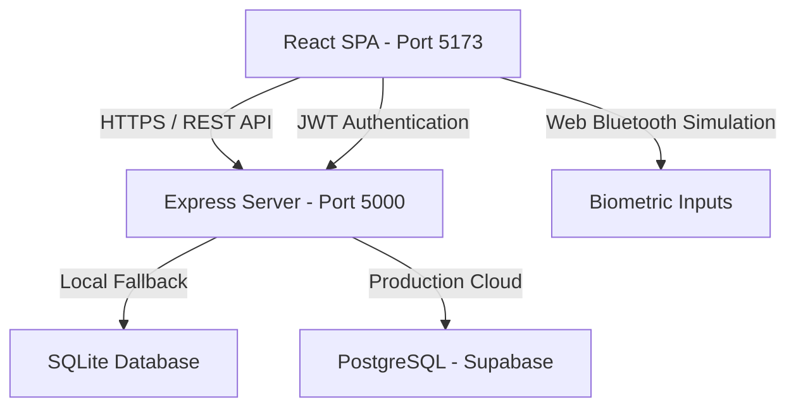

# Engineering Overview: ChronicCare Companion

This document provides a technical walkthrough of the ChronicCare Companion architecture, database configurations, and UI design systems.

---

## 🏗️ System Architecture

The application is structured as a decoupled Single Page Application (SPA) communicating with an Express REST API backend.



### 1. Frontend Structure
- **Entry Point**: [main.jsx](file:///home/deu/Coding%20Repos/Healthcare/src/main.jsx) mounts the App.
- **Routing & State**: [App.jsx](file:///home/deu/Coding%20Repos/Healthcare/src/App.jsx) orchestrates application views (Landing/Login page, Patient Onboarding Wizard, Patient Dashboard Grid, or Physician Portal) using session data provided by [useSyncState.js](file:///home/deu/Coding%20Repos/Healthcare/src/hooks/useSyncState.js).
- **Styling**: [index.css](file:///home/deu/Coding%20Repos/Healthcare/src/index.css) implements the Pinterest Design System styling variables.

### 2. Backend Structure
- **REST Endpoints**: [server/index.js](file:///home/deu/Coding%20Repos/Healthcare/server/index.js) defines CORS configurations, JWT verification middlewares, and REST endpoints.
- **Dual DB Adapter**: [server/db.js](file:///home/deu/Coding%20Repos/Healthcare/server/db.js) checks for `DATABASE_URL` env variable. If present, it connects via `pg` pool; otherwise, it opens a local `sqlite3` database.
- **Analytics Engine**: [server/analysis.js](file:///home/deu/Coding%20Repos/Healthcare/server/analysis.js) computes slopes, forecasts, streaks, and correlations.

---

## 🗄️ Database Schemas

The dual driver supports uniform tables across SQLite and PostgreSQL.

### Table: `users`
Tracks user login credentials and roles.
```sql
CREATE TABLE users (
  id INTEGER PRIMARY KEY AUTOINCREMENT / SERIAL,
  email TEXT UNIQUE NOT NULL,
  password_hash TEXT NOT NULL,
  role TEXT DEFAULT 'patient', -- 'patient' or 'physician'
  created_at DATETIME DEFAULT CURRENT_TIMESTAMP
);
```

### Table: `profiles`
Stores user profile information and target thresholds.
```sql
CREATE TABLE profiles (
  user_id INTEGER PRIMARY KEY REFERENCES users(id) ON DELETE CASCADE,
  name TEXT NOT NULL,
  conditions TEXT, -- Comma-separated list: e.g. "Diabetes, Anxiety"
  physician_name TEXT,
  physician_phone TEXT,
  physician_clinic TEXT,
  glucose_min INTEGER DEFAULT 80,
  glucose_max INTEGER DEFAULT 130,
  bp_sys_max INTEGER DEFAULT 130,
  bp_dia_max INTEGER DEFAULT 80,
  bp_stage TEXT DEFAULT 'Normal'
);
```

### Table: `logs`
Main clinical record containing multi-disease vitals telemetry.
```sql
CREATE TABLE logs (
  user_id INTEGER REFERENCES users(id) ON DELETE CASCADE,
  date TEXT NOT NULL, -- Format: "Jun 04"
  glucose INTEGER, -- Diabetes (mg/dL)
  bp_systolic INTEGER, -- Hypertension (mmHg)
  bp_diastolic INTEGER, -- Hypertension (mmHg)
  meal TEXT, -- Meal consumption status
  symptoms TEXT, -- Patient reported text
  anxiety_level INTEGER, -- Anxiety GAD-7 score (0-21)
  heart_rate INTEGER, -- Resting Heart Rate (bpm)
  peak_flow INTEGER, -- Asthma peak expiratory flow (L/min)
  inhaler_puffs INTEGER, -- Asthma rescue inhaler puff count
  pain_level INTEGER, -- Chronic Pain NRS scale (0-10)
  PRIMARY KEY (user_id, date)
);
```

### Table: `physician_patient_links`
Manages patient approval status for physicians.
```sql
CREATE TABLE physician_patient_links (
  physician_id INTEGER REFERENCES users(id) ON DELETE CASCADE,
  patient_id INTEGER REFERENCES users(id) ON DELETE CASCADE,
  status TEXT DEFAULT 'pending', -- 'pending' or 'active'
  PRIMARY KEY (physician_id, patient_id)
);
```

---

## 📡 REST API Directory

| Endpoint | Method | Auth | Description |
| :--- | :---: | :---: | :--- |
| `/api/auth/register` | POST | None | Creates a new patient or physician user and returns a JWT. |
| `/api/auth/login` | POST | None | Verifies user credentials and returns a JWT. |
| `/api/profile` | GET | JWT | Retrieves the user profile details. |
| `/api/profile` | POST | JWT | Inserts or updates the user profile targets and info. |
| `/api/logs` | GET | JWT | Retrieves daily biometric log history. |
| `/api/logs` | POST | JWT | Inserts or upserts daily logs (Glucose, BP, Anxiety, Pain, Asthma). |
| `/api/medications` | GET | JWT | Retrieves medication lists. |
| `/api/medications` | POST | JWT | Adds or updates medication compliance markers. |
| `/api/analysis` | GET | JWT | Triggers server-side clinical wellness forecasts and correlations. |
| `/api/physician/patients` | GET | Physician | Fetches linked patient profiles (active and pending rosters). |
| `/api/physician/link` | POST | Physician | Issues connection requests to patients. |
| `/api/physician/patient/:id/logs`| GET | Physician | Returns records for a linked patient (denied if status is 'pending'). |
| `/api/patient/links` | GET | Patient | Retrieves pending physician invitation requests. |
| `/api/patient/links/respond` | POST | Patient | Approves or declines physician links. |

---

## 🎨 Design System Specifications

Styles follow the layout guidelines in `DESIGN.md`:
*   **Color Palette**:
    - Primary Cream Backdrop: `var(--bg-app)` (`#FAF6F0`)
    - Brand Color Red: `var(--primary)` (`#e60023` - Pinterest Red)
    - Surface Cards: `var(--surface-card)` (`#ffffff`)
    - Border / Outlines: `var(--border-color)` (`#e2dcd5`)
*   **Typography**: Outfitted with a premium Serif font for clinical headings (`Outfit` / `Playfair Display`) and Sans-Serif font (`Inter`) for crisp body telemetry.
*   **Borders**: Rounded corners styled using `border-radius: 16px` for cards and `border-radius: 32px` for action inputs.
